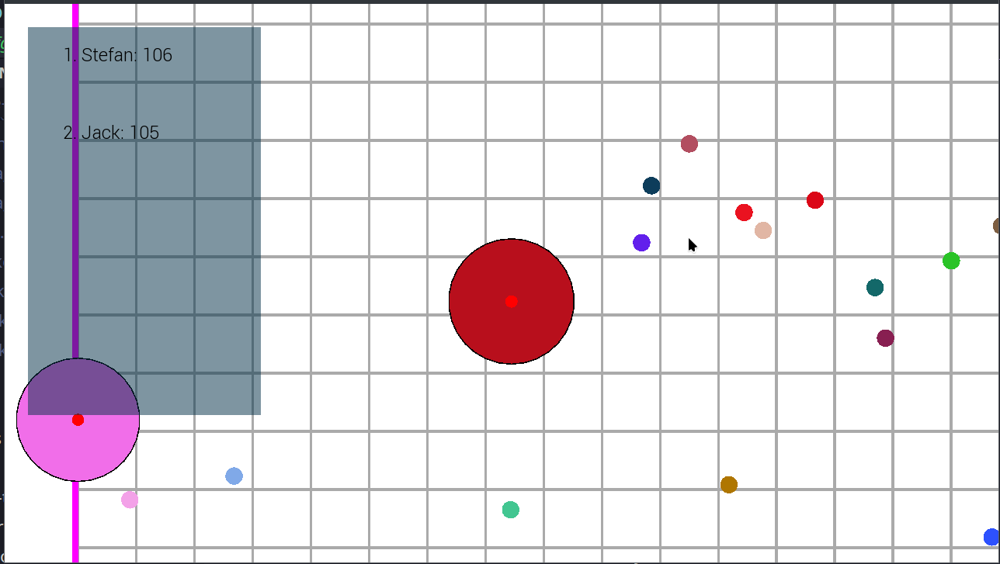
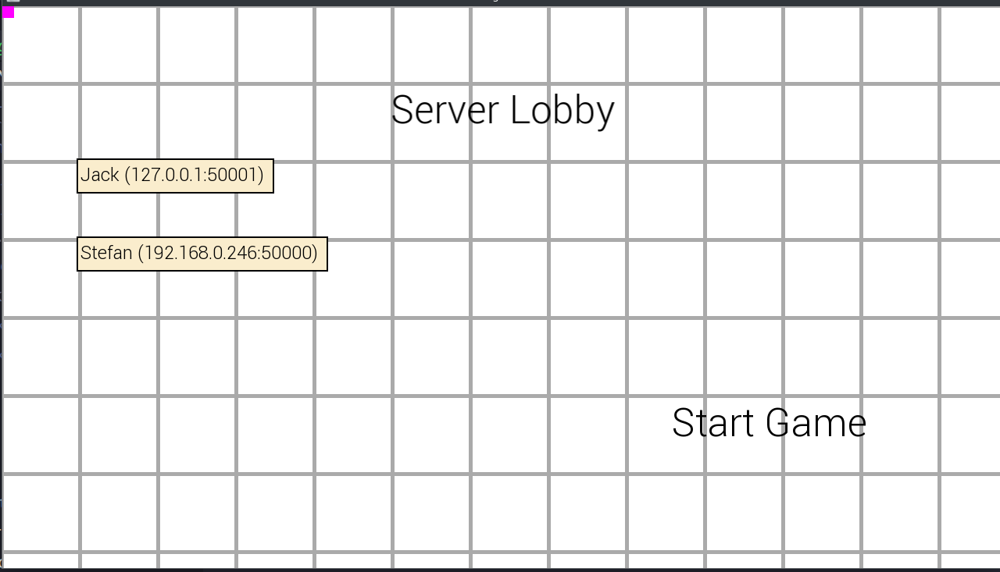

[![LinkedIn][linkedin-shield]][linkedin-url]

<h3 align="center">Agar io Clone</h3>

  

This project is an Agar.io clone developed in C++ using the SFML library for graphics and networking. It replicates the multiplayer online game where players control a cell and consume smaller cells to grow larger while avoiding being eaten by bigger cells.
  

### Built With

* [![C++][C++-shield]][C++-url]
* [![SFML][SFML]][SFML-url]

<!-- MARKDOWN LINKS & IMAGES -->
<!-- https://www.markdownguide.org/basic-syntax/#reference-style-links -->
[linkedin-shield]: https://img.shields.io/badge/linkedin-white?style=for-the-badge&logo=linkedin&logoColor=%230A66C2

[linkedin-url]: https://www.linkedin.com/in/tacudarius/
[C++-shield]: https://img.shields.io/badge/C%2B%2B-white?style=for-the-badge&logo=cplusplus&logoColor=00599C
[C++-url]: https://nextjs.org/
[SFML]: https://img.shields.io/badge/SFML-black?style=for-the-badge&logo=sfml&logoColor=8CC445
[SFML-url]: https://www.sfml-dev.org/

## Features

- Real-time multiplayer
- Score tracking
- Leaderboard
- Cell Growth